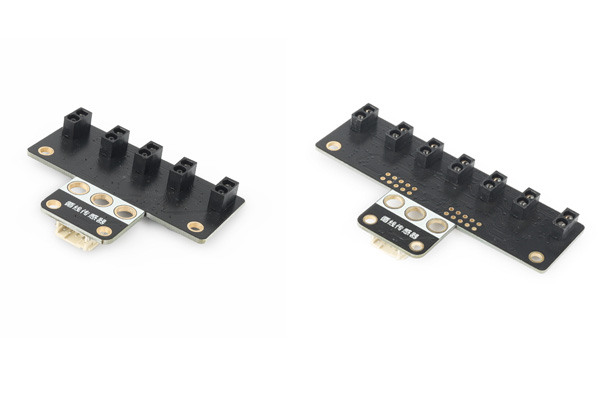

# Yfrobot-I2C-LineFollowSensor-Library
YFROBOT I2C Line Follow Sensor Library for Arduino

适用模块：[I2C Line Follow Sensor - 5]() 、 [I2C Line Follow Sensor - 7]()

#### 库使用说明：
调用库：

`#include <YFLineFollow.h>   // 包含头文件`

创建对象：

`YFLINEFOLLOW YFLS;`

Methods：

初始化，成功则返回1。

`YFLS.begin();`

读取传感器，lineSensor值可为 0、1、2、3、4；分别对应5路传感器；lineSensor值可为 0、1、2、3、4、5、6；分别对应7路传感器；
有反射返回值为1，无反射返回值0。

`YFLS.readSensor(lineSensor)`

禁用/使能传感器，默认使能。

`YFLS.enableSensor();`

`YFLS.disableSensor();`